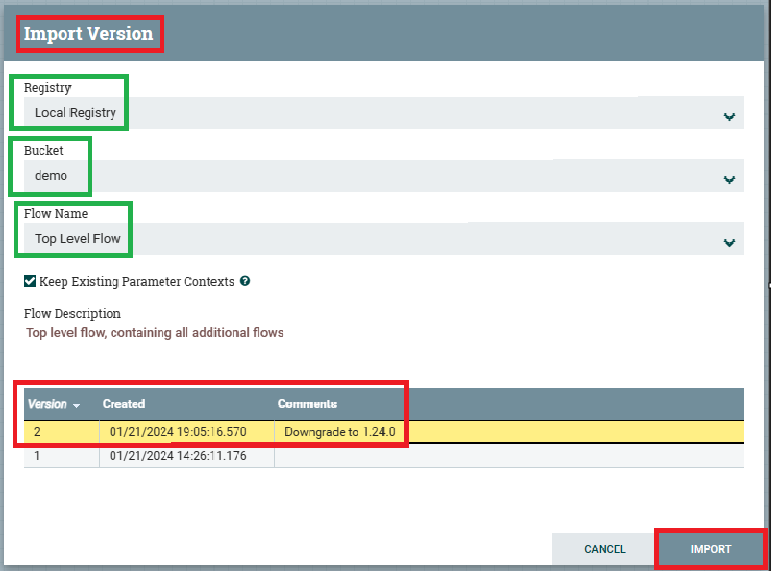

# Importing Demo Flows

This project comes with a predefined set of flows to provide a functional demo.

This section covers how to import these flows for usage.

The following steps need to be followed:

1. Log into the NiFi UI.
2. Click and drag a "Process Group" object onto the canvas.

   
3. An "Add Process Group" will appear. Click the "Import from Registry..." link.

   
4. An "Import Version" window will appear. It will pre-populate all the correct values. The only actions required on
   this page are:
    1. Select the latest version from the table at the bottom of the window.
        - _Note:_ This screenshot might be outdated, always select the highest version number.
    2. Click the "IMPORT" button.

   
5. You should now see a new flow named `Top Level Flow`

   
6. Right-click on this new flow, and click the "Enable all controller services", button on the menu.

   
7. Done! You have now imported the demo flows. The remainder of these docs will cover the usage and functionality of the
   different flows located under the `Top Level Flow`. You can either continue to follow the guide, or explore and learn
   on your own!

[Return to Usage Guide](../../README.md#usage)

Go to previous step: [Registry Clients](../registry-clients/setup.md)
