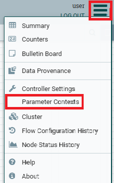
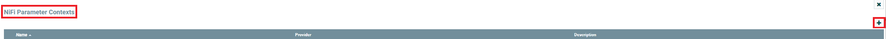
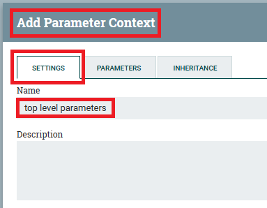
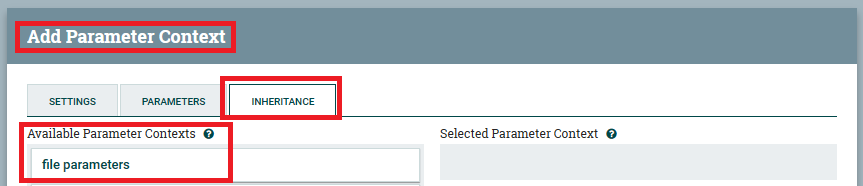
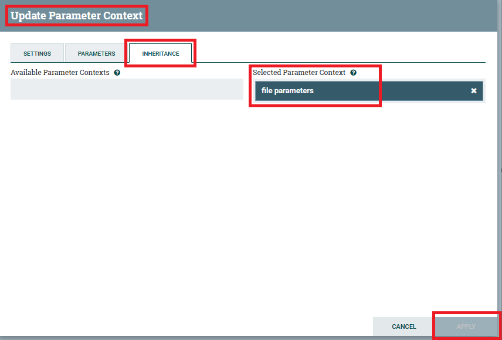

# Setting Up Parameter Contexts

For this demo to work, some parameter contexts need to be setup.

To do this, the following steps need to be taken:

1. Log into the NiFi UI.
2. In the upper right corner, click the _Sandwich_ menu, and select "Parameter Contexts".

   
3. On the "NiFi Parameter Contexts" window, click the "+" icon in the upper right.

   
4. On the "Add Parameter Context" window:
    1. On the "SETTINGS" tab:
        1. Set the "Name" value to: `top level parameters`

       
    2. On the "INHERITANCE" tab:
        1. Drag the "file parameters" value under "Available Parameter Contexts", to the "Selected Parameter Context".
            1. From:
               
            2. To:
               
    3. Click the "APPLY" button.
