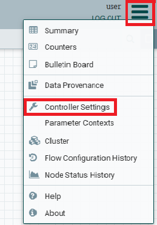
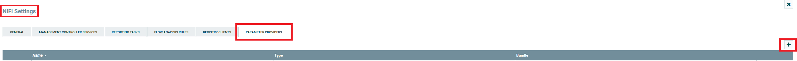
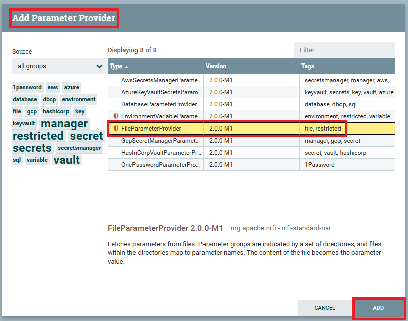
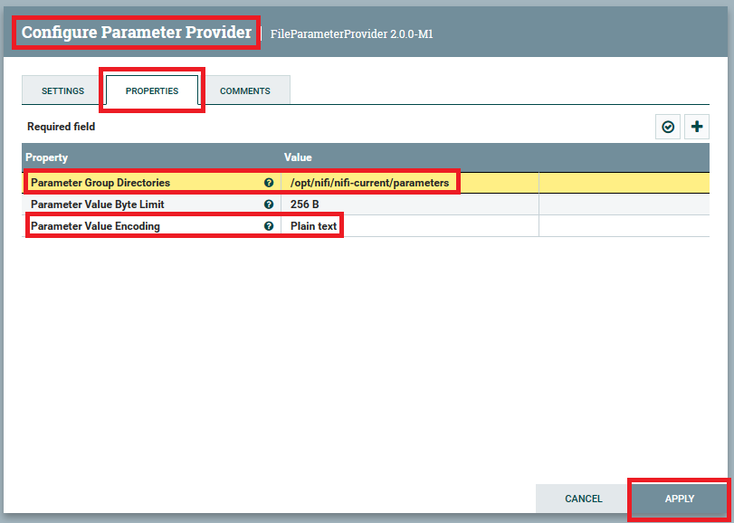
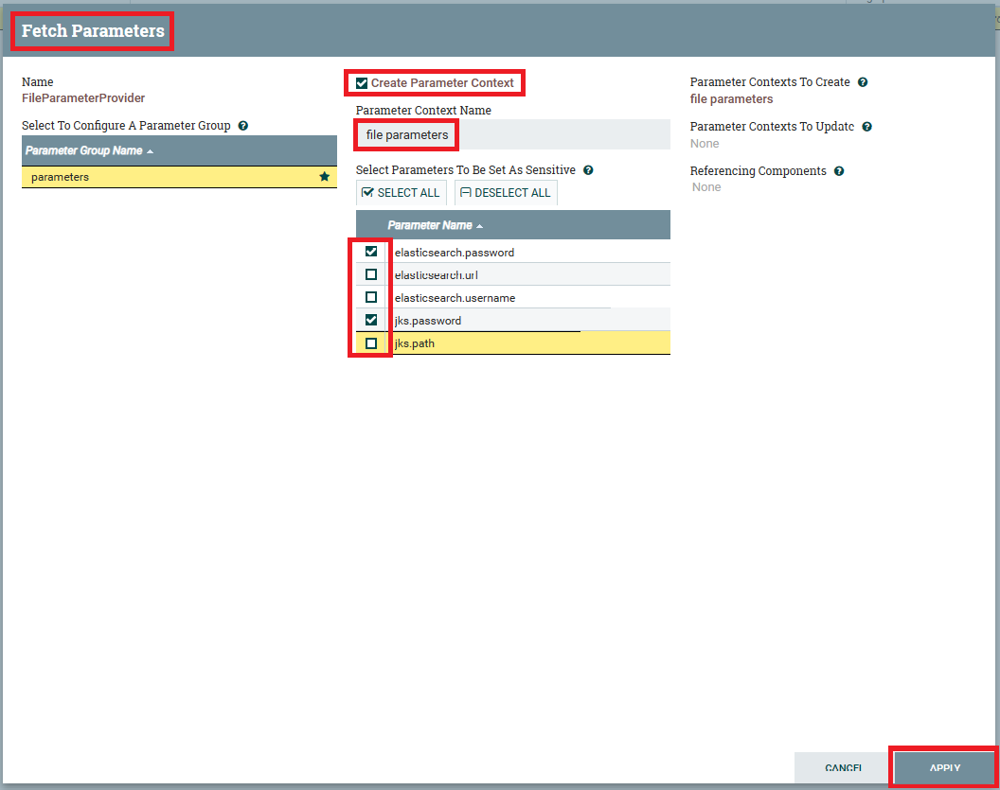

# Setting Up Parameter Providers

For this demo to work, some parameter providers need to be setup.

To do this the following steps need to be taken:

1. Log into the NiFi UI
2. In the upper right corner, click the Sandwich menu, and select "Controller Settings"
   
3. On the "NiFi Settings" window, select the "PARAMETER PROVIDERS" tab, then click the "+" icon in the upper right.
   
4. On the "Add Parameter Provider" page, select the "FileParameterProvider", and then click the "ADD" button.
   
5. Once the parameter provider has been added, click the "Edit" (pencil) icon on the provider line to enter the configuration window.
   
6. In the "Configure Parameter Provider" menu, click the "PROPERTIES" tab.
   1. Set the "Parameter Group Directories" value to: `/opt/nifi/nifi-current/parameters`.
   2. Change the "Parameter Value Encoding" from: `Base64` to: `Plain text`.
   3. Click the "APPLY" button.
   
7. Click the "Fetch Parameters" (down arrow) icon, on the provider line to create the Parameter Context.
   
8. On the "Fetch Parameters" window:
   1. _Check_ the "Create Parameter Context" box.
   2. Change the "Parameter Context Name" from: `parameters` to: `file parameters`.
   3. Under the "Select Parameters To Be Set As Sensitive", _uncheck_ the: `elasticsearch.url`, `elasticsearch.username`, and `jks.path` boxes. 
   4. Click "APPLY"
   