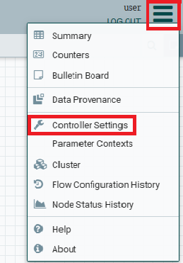
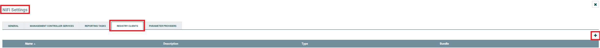
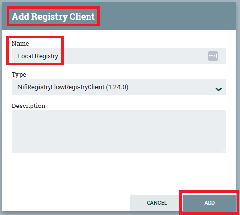
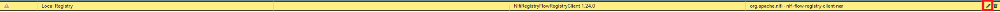
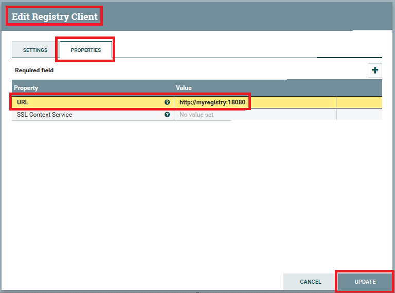

# Settings Up Registry Clients

We leverage a NiFi Registry to be able to import the demo flows.

_Note:_ This project contains a predefined version of the NiFi Registry DB and Flow Storage located
under: [nifi-registry](../../nifi-registry).

To be able to use the demo's NiFi registry, we need to configure this registry in NiFi.

The following steps can be taken for this:

1. Log into the NiFi UI.
2. In the upper right corner, click the Sandwich menu, and select "Controller Settings".

   
3. On the "NiFi Settings" window, select the "REGISTRY CLIENTS" tab, then click the "+" icon in the upper right.

   
4. On the "Add Registry Client" window:
    1. In the "Name" field enter the value: `Local Registry`.
    2. Click the "ADD" button.

   
5. Click the "Edit" (pencil) button on the newly added registry.

   
6. On the "Edit Registry Client" window:
    1. Select the "PROPERTIES" tab.
    2. Edit the "URL" property value, and set it to: `http://myregistry:18080`.
    3. Click the "UPDATE" button.

   
7. Done! The local registry can now be used.

[Return to Usage Guide](../../README.md#usage)
